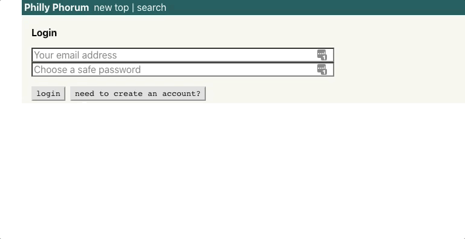
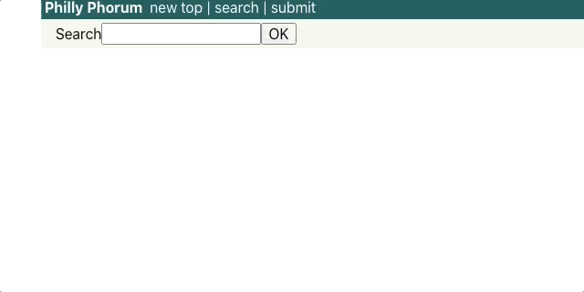
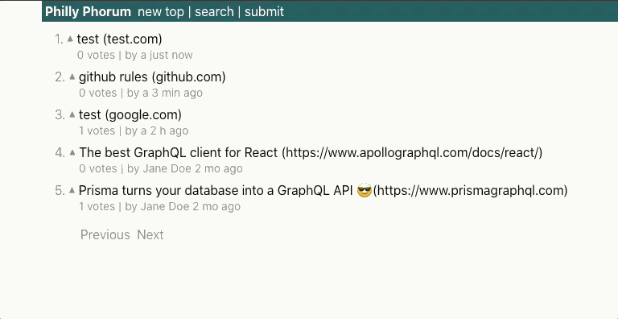
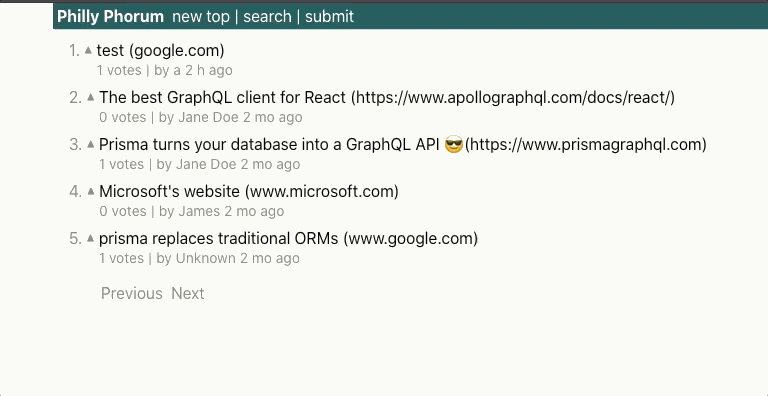
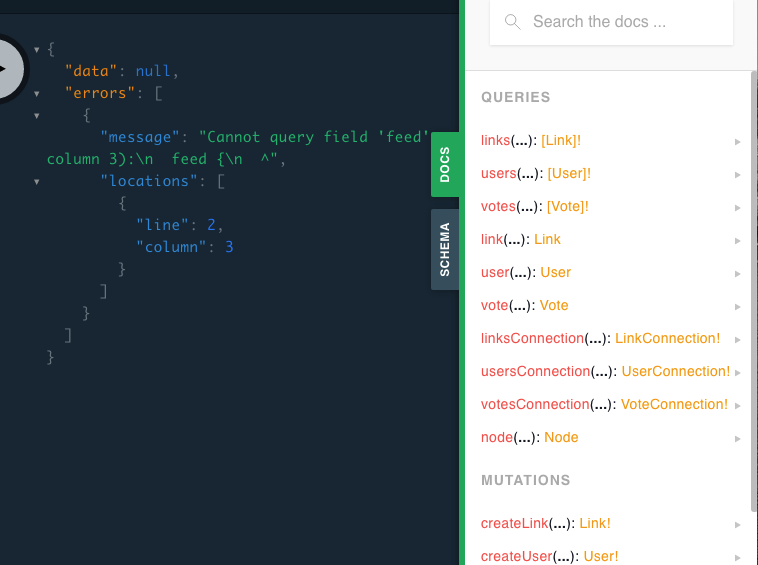

<h1 align="center">Philly Phorum</h1>

<p align="center">
  A social news forum for Philadelphia — link submission, voting, and full-text
  search over a GraphQL API, with JWT-authenticated accounts and real-time
  subscriptions.
</p>

<p align="center">
  
  
  
  
  
</p>

---

## Why

A social news site for Philadelphia, by Philadelphia — deliberately free of
corporate and political bias, advertising and monetization, and gamification.
No karma scores, no awards, no engagement mechanics. Post a link, vote on it,
move on.

The interface target was Craigslist: dense, fast, and visually uneventful.

## What It Does

- Persistent user accounts with signup and login
- Passwords hashed with bcrypt; sessions carried as JSON Web Tokens
- Link submission with URL and description
- Voting on submissions, with vote counts resolved per link
- Full-text search across posted links
- Paginated chronological feed and a vote-ranked top feed
- GraphQL subscriptions for pushing new links and votes to connected clients

## Screenshots

| Login | Search |
| :-- | :-- |
|  |  |

| Submit | Top posts |
| :-- | :-- |
|  |  |

Early navbar design, and the GraphQL Playground against the running schema:




## Architecture

```
┌────────────────────────────┐              ┌────────────────────────────┐
│  React client (CRA)        │   GraphQL    │  graphql-yoga server       │
│  src/components/           │ ───────────► │  philly-phorum-back/src/   │
│                            │  HTTP + WS   │                            │
│  Apollo Client 2.6         │              │  schema.graphql  (SDL)     │
│   ├─ apollo-cache-inmemory │              │  resolvers/                │
│   ├─ apollo-link-http      │              │   ├─ Query                 │
│   ├─ apollo-link-context ──┼── JWT header │   ├─ Mutation              │
│   └─ apollo-link-ws ───────┼── subs ────► │   ├─ Subscription          │
│                            │              │   ├─ User / Link / Vote    │
│  react-router 5            │              │        │                   │
└────────────────────────────┘              │        ▼                   │
                                            │  generated prisma-client   │
                                            └────────┬───────────────────┘
                                                     ▼
                                              Prisma 1 server ──► database
```

The client holds no business logic. Apollo Client issues queries and mutations
against a single endpoint and caches results normalized by ID, so a vote cast in
the top feed updates the same record wherever else it is rendered, without a
refetch. `apollo-link-context` attaches the stored JWT to every outbound
request; `apollo-link-ws` opens a websocket for subscriptions.

The server is **graphql-yoga**, schema-first: types live in
`src/schema.graphql` and resolvers are split by concern into `Query`,
`Mutation`, `Subscription`, and the type resolvers `User`, `Link`, and `Vote`.
The server's context function merges the incoming HTTP request with the
generated Prisma client, which is how resolvers read the `Authorization` header
to authenticate and how they reach the database.

Resolvers are thin — they authenticate, then delegate to the Prisma client,
which owns the data model and generates the queries.

A single `LinkList` component backs both `/top` and `/new/:page`; the route
determines the ordering and pagination arguments passed to the query, not the
component.

## Routes

| Path | Component | Purpose |
| :-- | :-- | :-- |
| `/top` | `LinkList` | Vote-ranked feed |
| `/new/:page` | `LinkList` | Chronological feed, paginated |
| `/create` | `CreateLink` | Submit a new link |
| `/search` | `Search` | Full-text search over submissions |
| `/login` | `Login` | Signup and login |

## Technology Stack

| Technology | Role | Why it's here |
| :-- | :-- | :-- |
| React 16 | Client UI | Component tree for feeds, submission, search, and auth |
| Create React App | Client build | Zero-config bundling and dev server |
| react-router 5 | Routing | Client-side routes, including paginated feed params |
| Apollo Client 2.6 | GraphQL client | Query execution plus a normalized cache keeping vote counts consistent across views |
| apollo-link-context | Auth | Attaches the stored JWT to every request |
| apollo-link-ws | Realtime | Websocket transport for subscriptions |
| graphql-yoga | API server | Schema-first GraphQL server with Playground built in |
| GraphQL (SDL) | Schema | One endpoint, one typed schema; the client requests exactly the fields it renders |
| Prisma 1 | Data access | Generated type-safe client; owns the data model in `datamodel.prisma` |
| bcryptjs | Password hashing | Salted hashing so plaintext passwords are never stored |
| jsonwebtoken | Sessions | Signs and verifies the tokens carried in the auth header |
| Tachyons | Styling | Functional CSS — kept the visual footprint minimal, matching the Craigslist target |

## Installation

Requires Node.js and the Prisma 1 CLI.

```bash
git clone https://github.com/fjs138/philly-phorum-front.git
cd philly-phorum-front
```

### Back end

```bash
cd philly-phorum-back
npm install

# Deploy the datamodel and generate the client (Prisma 1)
npx prisma1 deploy
npx prisma1 generate

npm start              # http://localhost:4000
```

`prisma/prisma.yml` points at the Prisma server endpoint and declares where the
client is generated. `prisma/datamodel.prisma` holds the `User`, `Link`, and
`Vote` models.

The server signs tokens with a secret read at runtime — set it in the
environment before starting.

### Front end

```bash
# from the repo root, in a second shell
npm install
npm start              # http://localhost:3000
```

The client expects the GraphQL endpoint at `http://localhost:4000`.

## Project Structure

| Path | Purpose |
| :-- | :-- |
| `src/components/` | React components — `LinkList`, `CreateLink`, `Search`, `Login`, `Link` |
| `src/` | Client entry point and Apollo Client link configuration |
| `philly-phorum-back/src/index.js` | Server entry — schema, resolvers, context |
| `philly-phorum-back/src/schema.graphql` | SDL schema definition |
| `philly-phorum-back/src/resolvers/` | `Query`, `Mutation`, `Subscription`, `User`, `Link`, `Vote` |
| `philly-phorum-back/src/generated/` | Generated Prisma client |
| `philly-phorum-back/prisma/datamodel.prisma` | Data model |
| `philly-phorum-back/prisma/prisma.yml` | Prisma service configuration |
| `public/` | Static assets and HTML shell |

## Design Notes

**Why one repository for two applications.** The client and server were
developed independently and neither imports the other. They ship together
because neither is useful alone.

**Why GraphQL over REST.** The feeds need a link, its vote count, and its
submitter in one round trip, and the same `Link` type is rendered in four places
with different field requirements. A single typed schema handled that without
either over-fetching or maintaining four endpoint variants.

**Why schema-first.** Writing `schema.graphql` before the resolvers made the API
contract reviewable on its own, and splitting resolvers by type kept each file
to one concern rather than one large object literal.

**Why a normalized cache.** Votes appear in the top feed, the new feed, and
search results simultaneously. Normalizing by ID means one mutation result
updates every view, which is the whole reason to prefer Apollo's cache over
plain fetch.

**Why no gamification.** Karma, streaks, and awards optimize for time-on-site,
which is the mechanism the site exists to avoid. Voting exists solely to rank
the feed; scores are not attached to user profiles.

**Why Tachyons.** Functional CSS meant no stylesheet grew alongside the
component tree, and the deliberately plain visual target made a design system
unnecessary.

## Known Limitations

This is a 2020 project, kept as-is. If it were revived:

- Prisma 1 is end-of-life; a rebuild would target Prisma 5+ with `schema.prisma`
- The JWT signing secret and Prisma endpoint are read from the environment with no example file committed
- There is no test suite, despite `@testing-library` being installed by CRA

## License

MIT © 2020 Frank Santaguida.

<!-- TODO: philly-phorum-back/package.json declares "license": "ISC" and there
     is no LICENSE file. Add one and make them agree. -->
